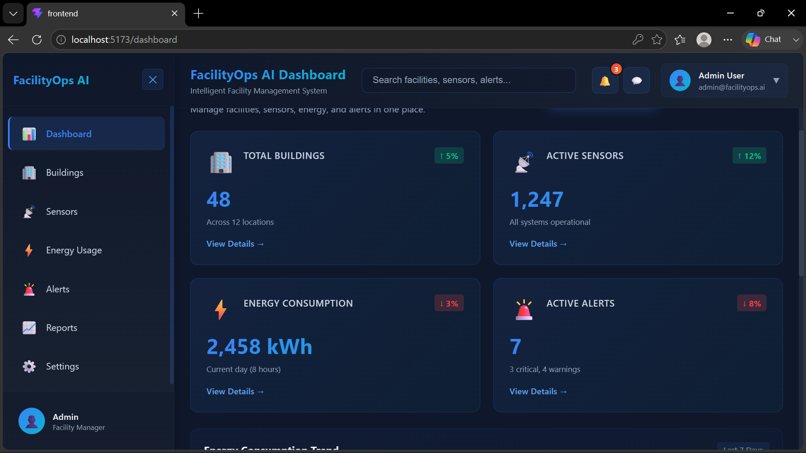
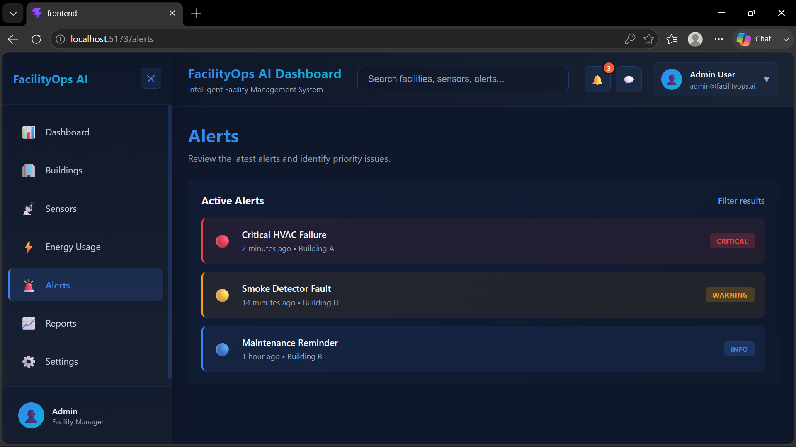
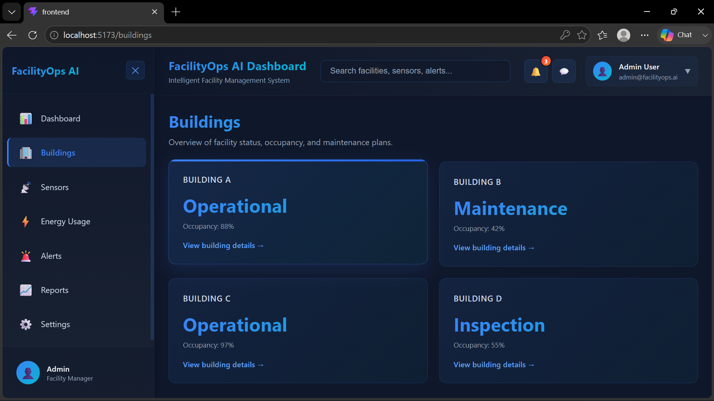
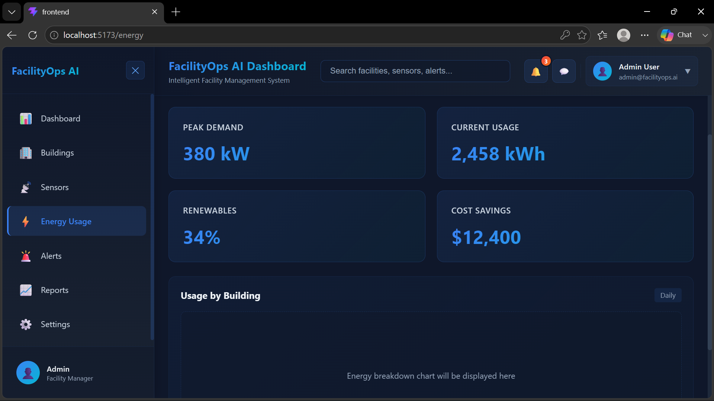
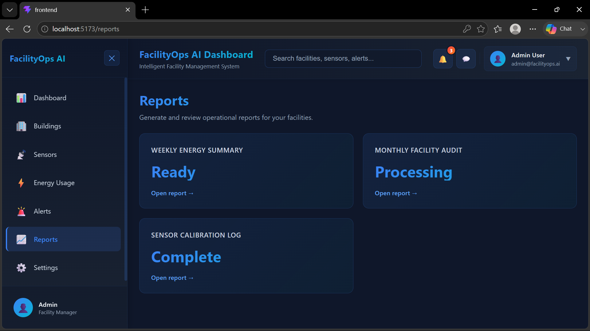
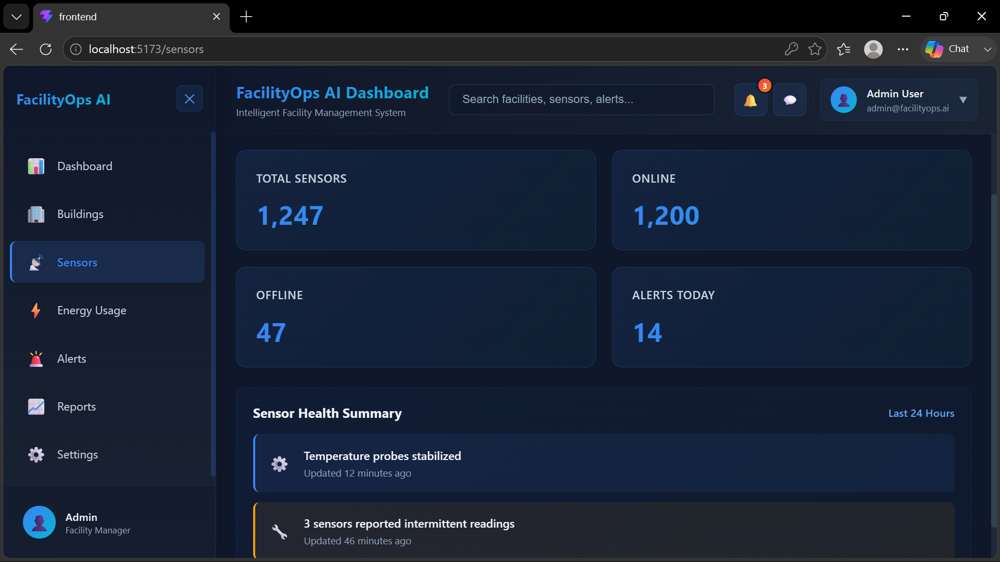
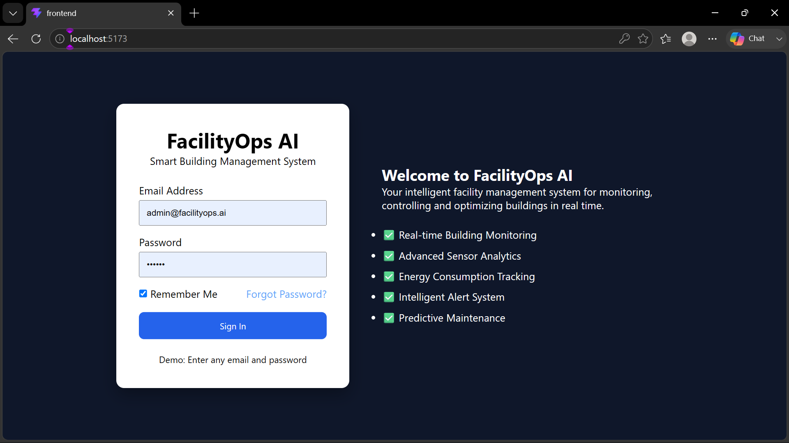

# 🏢 FacilityOps AI

## 🚀 AI-Powered Smart Building & Facility Management System

FacilityOps AI is a web application for monitoring buildings, sensors, energy usage, alerts, and reports.

## ✨ Features

- 🔐 Secure Login
- 🏢 Building Management
- 📡 Sensor Monitoring
- ⚡ Energy Dashboard
- 🚨 Alerts
- 📊 Reports
- ⚙️ Settings
- 📱 Responsive Design

## 🛠 Tech Stack

- React
- Vite
- JavaScript
- Python
- Flask
- SQLite

## 📂 Project Structure

```
frontend/
backend/
README.md
```
## 📸 Project Screenshots

### Dashboard


### Alerts


### Buildings


### Energy


### Reports


### Sensors


### Settings


### Login


## 👨‍💻 Developer

**Sunil**

B.Tech Computer Science Engineering

## ⭐ Thank you for visiting this project!
